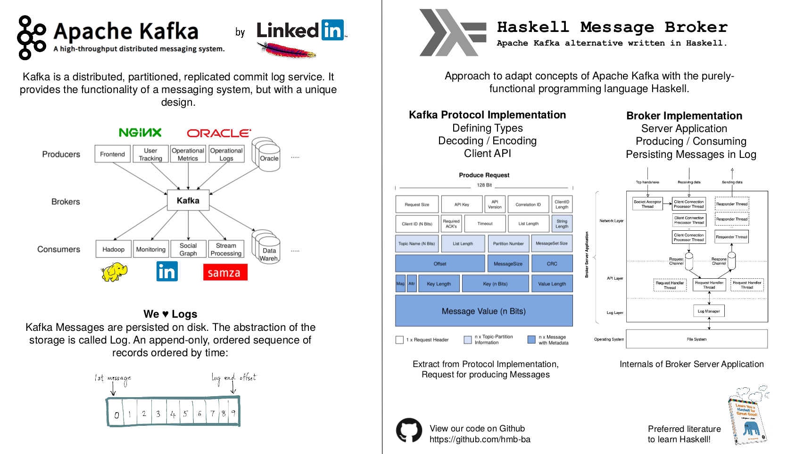



### [Codag](http://codag.ch)

I'm the owner of Code Agency Juchli (Codag).

Codag provides agile Software Engineering with a main focus on Web development, Restful APIs, Messaging.
We rely on open source in our daily business. To give the community something back, we from time to time open source some of our in-house developed projects (see [Codag@Github](https://github.com/Codag)) or contribute to other projects directly.

Besides, with interests in server administration, service quality and availability as well as the open source project [ISPConfig](http://ispconfig.org), we are maintaining a powerful hosting environment:

  

* * *

### Haskell Message Broker (HMB) <small>(Bachelors Thesis)</small>

**Thesis:** [PDF Download](../uploads/Thesis_eprints_mjuchli_lwolf.pdf)  
**Poster:** [PDF Download](../uploads/Thesis_Poster_mjuchli_lwolf.pdf)  
**GitHub:** [https://github.com/hmb-ba](https://github.com/hmb-ba)  

The aim of this thesis is to provide a summary of the current state of message
oriented-middleware and eventually build a message broker in Haskell, adapted
from the concepts of Apache Kafka which was originally built at LinkedIn. The
implementation shall provide basic functionalities such as producing and
consuming messages, with the aim to approximate performance of Apache Kafka
in a non-clustered setup. The Apache Kafka Protocol is being used as the
underlying wire-protocol and is implemented in a standalone library. On top of
the procotol library, a separate client library is provided. Thus, the Haskell
Message Broker (HMB) as well as its producer and consumer clients have been
successfully proofed as compatible with Apache Kafka.

This thesis first examines the fundamental concepts behind messaging and
discloses the needs for message brokers.  In a second stage of this
technology research, the purpose of event-streaming is described, containing a
comparison of batch and stream processing by explaining the
differences in their nature. Finally the concept and features of Apache
Kafka is presented.  Insights into the HMB implementation is provided in the
technical report and is split into two stages.  At first, the protocol
and client library is introduced. Subsequently the broker implementation
is explained including its capabilities as well as the provided
set of features. After all, HMB is applied to a benchmark against
Apache Kafka.

The results of this proof of concept shows that Haskell is well suited to build
messaging applications as well as implementing protocols based on context free
grammars. The from HMB provided performance hit the one of Apache Kafka for
transmission of larger message sizes during the benchmark. For the most tested
scenarios the performance suffers as HMB is not sufficiently optimized yet.
However, the Haskell Message Broker is a well established basis of a
state-of-the-art message broker implementation. The authors recommend to apply
further optimization techniques as well as extending the feature-set before any
other use.

   

* * *

### Smart Meeting Planner <small>(Studienarbeit)</small>

<b>Thesis:</b> <a href="../uploads/Thesis_Studienarbeit_SMP.pdf">PDF Download</a> 
<b>Project Partner:</b> Flughafen Zürich AG

Die Organisation von Meetings in grösserem Geschäftsumfeld, insbesondere beim Flughafen Zü-
rich, gestaltet sich als zunehmend komplizierter und wird durch die bestehenden Mail- und
Kalendersysteme noch zu wenig gut unterstützt. Vielfach müssen dafür verschiedene Dienste wie
z.B. der Microsoft Exchange Kalender, Doodle Pools und klassische Mails/Anrufe kombiniert
eingesetzt werden, um den Prozess der Terminfindung bis zur Termineinladung zu meistern.
Dies liegt daran, dass die einzelnen Dienste nur spezifische Aspekte für sich besonders gut un-
terstützen (z.B. gemeinsamer Kalender, Termin-Umfrage).
  
Im konkreten Fall von Microsoft Exchange Server mit Outlook Clients ist zwar gemeinsame
Termineinladung und Einsicht in die Ressourcen (Kalender von Personen und Räumen) gut
unterstützt. Jedoch fehlt ein effizienter Mechanismus, um freie Terminvorschläge zwischen be-
teiligten Personen mit entsprechenden freien Räumlichkeiten zu eruieren. Dies lässt sich durch
Einsatz einer externen Termin-Umfrage (wie z.B. Doodle) bewältigen, wobei dies jedoch in vielen
Unternehmungen aus Gründen von Geheimhaltung und Datenschutz vermieden wird.
  
Das Ziel dieser Studienarbeit ist es deshalb, einen Prozess zur verbesserten intelligente Termin-
findung zu konzipieren. Dieser soll dann als Prototyp mit Integration in den Microsoft Exchange
Servers (allenfalls mit Outlook) implementiert werden.

   

* * *

### Issue Bidder

Since we live in a fast, growing and busy world you don't have always time to fix important issues and you don't have always time to implement new things on existing systems. That's okay and that's just normal - even though they would be important. Here comes Issue Bidder in the game. We let you post an Issue created on GitHub so that not only you but also any other people they are interested in that issue, can offer any amount of money in the hope that an other developer can fix this.
  
The application is built with Symfony2 and makes among other things extensive use of the following API's:
<ul>
    <li>GitHub</li>
    <li>PayPal</li>
</ul>
The server setup is based on a personal created VPS server.
A NGINX webserver with a tailored configuration and SSL certificate brings the necessary performance and security.
  
<b>Link: <a target="_blank" href="https://issue-bidder.com">www.issue-bidder.com</a></b>
   

* * *

### VKweb

**A management and planing tool for the Verkehrskadetten Zürichsee.**

VKweb initially was a is a school project (Software Engineering Project) together with 3 team members. As this is a Symfony2 project on server-side my role is also to lead the team in terms of technical decisions and the procedure of development.
  
As the customer was planing each event using multiple excel sheets the goal is to centralize each process into one application. This will prevent the customer redundancy and significantly decrease the amount of mistakes during the process.
Consequently this lets the customer plan an event more efficient.
  
Technologies:
<ul>
    <li>Server-Side: RESTful API using Symfony2</li>
    <li>Client-Side: AngularJS</li>
    <li>Projectmanagement: Atlassian JIRA/Confluence</li>
</ul>
 
<b>Project Information: <a target="_blank" href="http://vkweb.codag.ch">vkweb.codag.ch</a></b>
